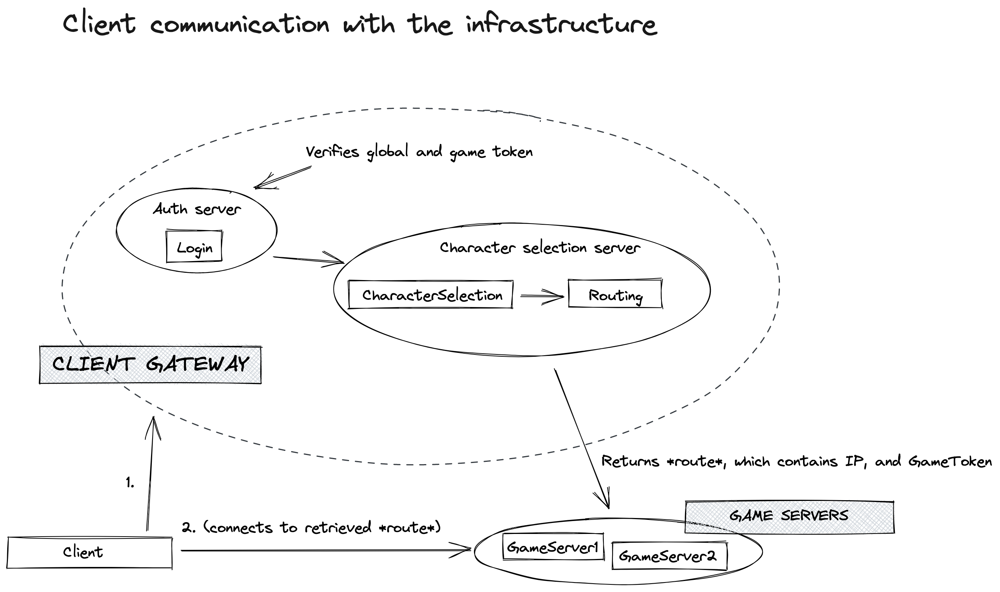
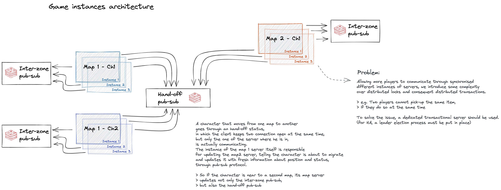
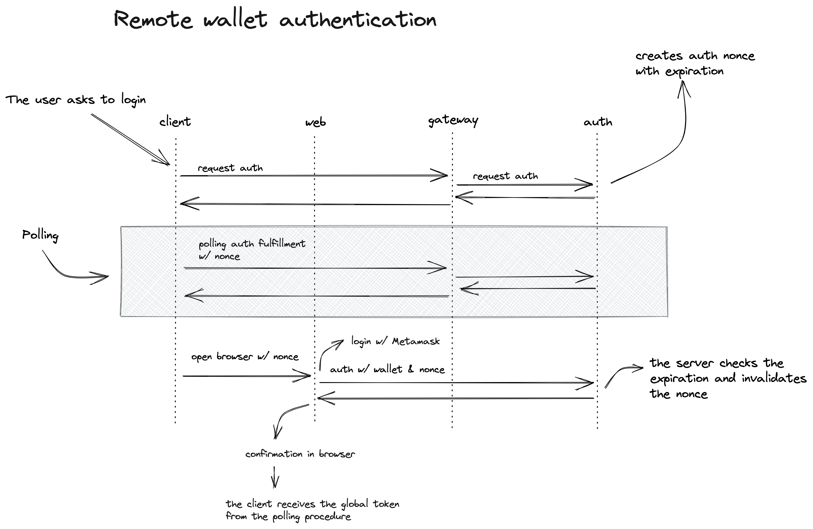

<h2 align=center>Client communication</h2>

 

<a href="./client-communication">
    <picture>
    <source media="(prefers-color-scheme: dark)" srcset="./client-communication/client-communication-dark.png">
    
    </picture>
</a>

***

<h2 align=center>Game instances</h2>

 

<a href="./game-instances-architecture">
    <picture>
    <source media="(prefers-color-scheme: dark)" srcset="./game-instances-architecture/game-instances-architecture-dark.png">
    
    </picture>
</a>

***

<h2 align=center>Remote wallet authentication</h2>

 

<a href="./remote-wallet-authentication">
    <picture>
    <source media="(prefers-color-scheme: dark)" srcset="./remote-wallet-authentication/remote-wallet-authentication-dark.png">
    
    </picture>
</a>

***

<h2 align=center>Initial connection saga  </h2>

 

<a href="./initial-connection-saga">
    <picture>
    <source media="(prefers-color-scheme: dark)" srcset="./initial-connection-saga/initial-connection-saga-dark.png">
    
    </picture>
</a>
